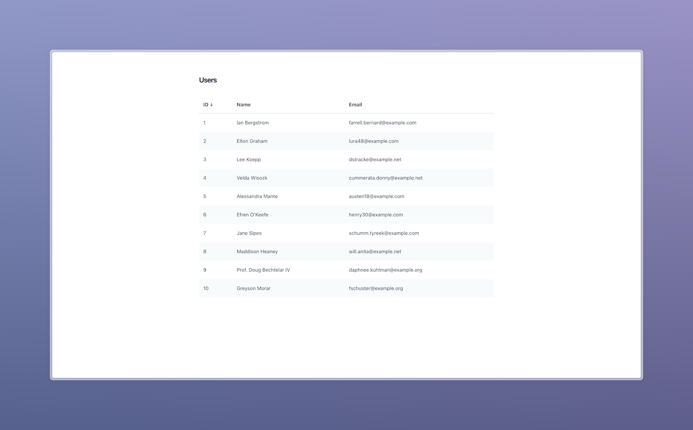

# Data Tables with Laravel and HTMX



This is my favorite way of building data tables in Laravel.

To get some test users, you can run this snippet inside Tinker:

```php
\App\Models\User::factory(20)->create();
```
